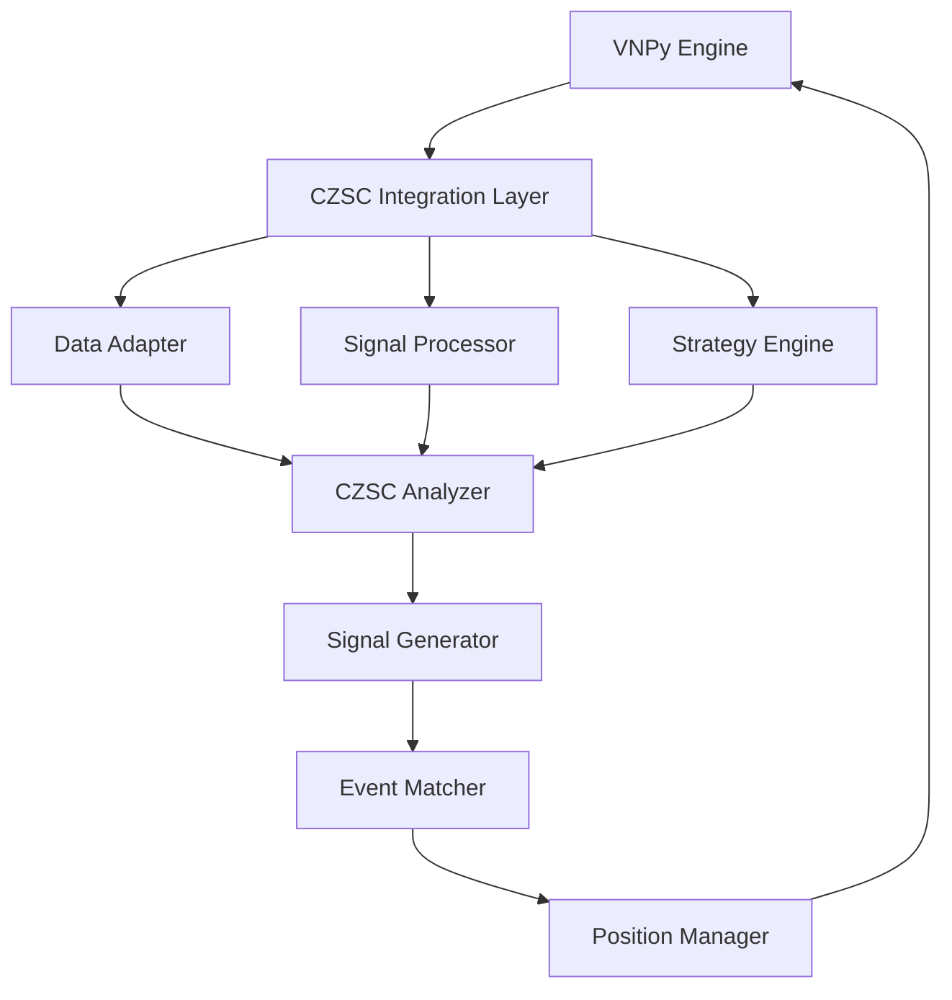

# CZSC Enhanced VNPy 集成 API 设计说明书

## 概述

本文档为 CZSC Enhanced 项目与 VNPy 量化交易框架集成提供完整的 API 设计指导。CZSC Enhanced 是基于缠中说禅技术分析理论的 Python 量化分析框架，具有强大的技术分析能力和信号生成系统。

## 目录

1. [核心架构设计](#1-核心架构设计)
2. [数据接口设计](#2-数据接口设计)
3. [信号系统API](#3-信号系统api)
4. [策略引擎集成](#4-策略引擎集成)
5. [事件驱动系统](#5-事件驱动系统)
6. [实时交易接口](#6-实时交易接口)
7. [配置管理系统](#7-配置管理系统)
8. [错误处理机制](#8-错误处理机制)
9. [性能监控API](#9-性能监控api)
10. [开发示例](#10-开发示例)

---

## 1. 核心架构设计

### 1.1 整体架构图



### 1.2 核心组件定义

#### 1.2.1 CZSC Integration Manager

```python
class CzscIntegrationManager:
    """CZSC VNPy 集成管理器"""
    
    def __init__(self, config: Dict[str, Any]):
        """
        初始化集成管理器
        
        Args:
            config: 配置字典，包含以下参数：
                - symbols: List[str] - 交易品种列表
                - frequencies: List[str] - 分析周期列表
                - signals_config: List[Dict] - 信号配置
                - strategy_config: Dict - 策略配置
                - risk_config: Dict - 风控配置
        """
        self.config = config
        self.data_adapters: Dict[str, CzscDataAdapter] = {}
        self.signal_processors: Dict[str, CzscSignalProcessor] = {}
        self.strategy_engines: Dict[str, CzscStrategyEngine] = {}
        
    def initialize(self) -> bool:
        """初始化所有组件"""
        pass
        
    def update_bar(self, symbol: str, bar: BarData) -> None:
        """更新K线数据"""
        pass
        
    def get_trading_signals(self, symbol: str) -> List[TradingSignal]:
        """获取交易信号"""
        pass
        
    def get_risk_metrics(self, symbol: str) -> Dict[str, float]:
        """获取风险指标"""
        pass
```

---

## 2. 数据接口设计

### 2.1 数据适配器

#### 2.1.1 VNPy到CZSC数据转换

```python
class CzscDataAdapter:
    """VNPy 数据适配器"""
    
    def __init__(self, symbol: str, frequencies: List[str]):
        """
        初始化数据适配器
        
        Args:
            symbol: 交易品种代码
            frequencies: 需要分析的周期列表 ['1m', '5m', '15m', '30m', '1h', '1d']
        """
        self.symbol = symbol
        self.frequencies = frequencies
        self.bar_generators: Dict[str, BarGenerator] = {}
        self.czsc_analyzers: Dict[str, CZSC] = {}
        
    def convert_vnpy_bar(self, vnpy_bar: BarData) -> RawBar:
        """
        将VNPy BarData转换为CZSC RawBar
        
        Args:
            vnpy_bar: VNPy的K线数据对象
            
        Returns:
            RawBar: CZSC的原始K线对象
            
        Example:
            >>> adapter = CzscDataAdapter('BTCUSDT', ['1m', '5m'])
            >>> vnpy_bar = BarData(...)
            >>> czsc_bar = adapter.convert_vnpy_bar(vnpy_bar)
        """
        freq_mapping = {
            Interval.MINUTE: Freq.F1,
            Interval.HOUR: Freq.F60,
            Interval.DAILY: Freq.D,
        }
        
        return RawBar(
            symbol=vnpy_bar.symbol,
            id=self._generate_bar_id(vnpy_bar),
            dt=vnpy_bar.datetime,
            freq=freq_mapping.get(vnpy_bar.interval, Freq.F1),
            open=vnpy_bar.open_price,
            close=vnpy_bar.close_price,
            high=vnpy_bar.high_price,
            low=vnpy_bar.low_price,
            vol=vnpy_bar.volume,
            amount=vnpy_bar.turnover or vnpy_bar.volume * vnpy_bar.close_price,
            cache={}
        )
    
    def update_multi_frequency_bars(self, base_bar: RawBar) -> Dict[str, List[RawBar]]:
        """
        更新多周期K线数据
        
        Args:
            base_bar: 基础周期K线
            
        Returns:
            Dict[str, List[RawBar]]: 各周期K线数据字典
        """
        for freq in self.frequencies:
            if freq not in self.bar_generators:
                self.bar_generators[freq] = BarGenerator(
                    base_freq='1m',
                    freqs=[freq],
                    max_count=1000
                )
            
            self.bar_generators[freq].update(base_bar)
            
            # 更新CZSC分析器
            if freq not in self.czsc_analyzers:
                self.czsc_analyzers[freq] = CZSC()
                
            bars = self.bar_generators[freq].bars.get(freq, [])
            if bars:
                self.czsc_analyzers[freq].update(bars[-1])
        
        return {freq: bg.bars.get(freq, []) for freq, bg in self.bar_generators.items()}
    
    def get_czsc_data(self, frequency: str) -> Dict[str, Any]:
        """
        获取CZSC分析数据
        
        Args:
            frequency: 分析周期
            
        Returns:
            Dict包含：
                - bars: 原始K线数据
                - bars_ubi: 无包含关系K线
                - fx_list: 分型列表
                - bi_list: 笔列表
                - signals: 信号字典
        """
        czsc = self.czsc_analyzers.get(frequency)
        if not czsc:
            return {}
            
        return {
            'bars': czsc.bars_raw,
            'bars_ubi': czsc.bars_ubi, 
            'fx_list': czsc.fx_list,
            'bi_list': czsc.bi_list,
            'signals': czsc.signals,
            'finished_bis': czsc.finished_bis,
            'ubi': czsc.ubi
        }
```

#### 2.1.2 数据质量检查

```python
class DataQualityChecker:
    """数据质量检查器"""
    
    @staticmethod
    def check_bar_continuity(bars: List[RawBar]) -> Dict[str, Any]:
        """
        检查K线数据连续性
        
        Returns:
            Dict包含：
                - is_continuous: bool - 是否连续
                - missing_periods: List[datetime] - 缺失时间段
                - duplicate_periods: List[datetime] - 重复时间段
        """
        pass
        
    @staticmethod
    def check_price_validity(bars: List[RawBar]) -> Dict[str, Any]:
        """
        检查价格数据有效性
        
        Returns:
            Dict包含：
                - is_valid: bool - 价格是否有效
                - invalid_bars: List[RawBar] - 无效K线
                - price_anomalies: List[Dict] - 价格异常
        """
        pass
```

---

## 3. 信号系统API

### 3.1 信号处理器

```python
class CzscSignalProcessor:
    """CZSC信号处理器"""
    
    def __init__(self, symbol: str, signals_config: List[Dict]):
        """
        初始化信号处理器
        
        Args:
            symbol: 交易品种
            signals_config: 信号配置列表
                Example:
                [
                    {
                        'name': 'czsc.signals.cxt_bi_status_V230101',
                        'freq': '30分钟',
                        'di': 1,
                        'params': {'timeout': 100}
                    },
                    {
                        'name': 'czsc.signals.tas_ma_base_V221101', 
                        'freq': '日线',
                        'di': 1,
                        'ma_type': 'SMA',
                        'timeperiod': 20
                    }
                ]
        """
        self.symbol = symbol
        self.signals_config = signals_config
        self.signal_functions = self._load_signal_functions()
        self.signal_cache = OrderedDict()
        
    def update_signals(self, czsc_data: Dict[str, Dict[str, Any]]) -> Dict[str, str]:
        """
        更新所有配置的信号
        
        Args:
            czsc_data: 各周期CZSC数据字典
                {
                    '1分钟': {...},
                    '5分钟': {...},
                    '30分钟': {...}
                }
                
        Returns:
            Dict[str, str]: 信号字典
                {
                    '30分钟_笔状态_V230101': '向上_已确认_任意_80',
                    '日线_MA基础_V221101': '多头_强势_任意_85'
                }
        """
        current_signals = OrderedDict()
        
        for config in self.signals_config:
            freq = config['freq']
            func_name = config['name']
            
            if freq not in czsc_data:
                continue
                
            # 构建CZSC对象（用于信号函数调用）
            czsc = self._build_czsc_from_data(czsc_data[freq])
            
            # 调用信号函数
            if func_name in self.signal_functions:
                try:
                    signals = self.signal_functions[func_name](czsc, **config)
                    current_signals.update(signals)
                except Exception as e:
                    logger.error(f"信号计算失败 {func_name}: {e}")
        
        # 更新缓存
        self.signal_cache.update(current_signals)
        
        # 限制缓存大小
        while len(self.signal_cache) > 10000:
            self.signal_cache.popitem(last=False)
            
        return current_signals
    
    def get_signal_strength(self, signal_key: str) -> int:
        """
        获取信号强度
        
        Args:
            signal_key: 信号键值
            
        Returns:
            int: 信号强度 (0-100)
        """
        signal_value = self.signal_cache.get(signal_key, "")
        if signal_value:
            # 信号格式：k1_k2_k3_v1_v2_v3_score
            parts = signal_value.split('_')
            if len(parts) >= 7:
                try:
                    return int(parts[-1])
                except ValueError:
                    return 0
        return 0
    
    def get_signals_by_pattern(self, pattern: str) -> Dict[str, str]:
        """
        根据模式匹配获取信号
        
        Args:
            pattern: 匹配模式，支持通配符
                Example: "*笔状态*", "日线_*_V2*"
                
        Returns:
            Dict[str, str]: 匹配的信号字典
        """
        import fnmatch
        matched_signals = {}
        
        for key, value in self.signal_cache.items():
            if fnmatch.fnmatch(key, pattern):
                matched_signals[key] = value
                
        return matched_signals
```

### 3.2 自定义信号开发接口

```python
class CustomSignalBuilder:
    """自定义信号构建器"""
    
    @staticmethod
    def create_signal_template(signal_name: str, version: str) -> str:
        """
        创建信号函数模板
        
        Args:
            signal_name: 信号名称
            version: 版本号（格式：V241201）
            
        Returns:
            str: 信号函数模板代码
        """
        template = f'''
def {signal_name}_{version}(c: CZSC, **kwargs) -> dict:
    """
    {signal_name} 信号函数
    
    参数模板：
    - param1: 参数1说明
    - param2: 参数2说明
    
    信号逻辑：
    - 描述信号计算逻辑
    
    信号表：
    | 信号 | 描述 | 
    | --- | --- |
    | 看多_强势_任意 | 强烈看多信号 |
    | 看空_弱势_任意 | 强烈看空信号 |
    """
    freq = c.freq.value
    k1, k2, k3 = f"{{freq}}", "{signal_name}", "{version}"
    
    # 获取参数
    param1 = kwargs.get('param1', 默认值)
    param2 = kwargs.get('param2', 默认值)
    
    # 数据验证
    if len(c.bi_list) < 需要的最小笔数:
        return {{f"{{k1}}_{{k2}}_{{k3}}": "无效_其他_其他_0"}}
    
    # 信号计算逻辑
    # TODO: 实现您的信号逻辑
    
    # 构建信号
    if 看多条件:
        v1, v2, v3 = "看多", "强势", "任意"
        score = 85  # 信号强度
    elif 看空条件:
        v1, v2, v3 = "看空", "弱势", "任意" 
        score = 80
    else:
        v1, v2, v3 = "观望", "其他", "任意"
        score = 0
    
    signal = f"{{k1}}_{{k2}}_{{k3}}_{{v1}}_{{v2}}_{{v3}}_{{score}}"
    return {{f"{{k1}}_{{k2}}_{{k3}}": signal}}
'''
        return template
    
    @staticmethod
    def register_signal_function(func: Callable, module_path: str) -> bool:
        """
        注册自定义信号函数
        
        Args:
            func: 信号函数
            module_path: 模块路径
            
        Returns:
            bool: 注册是否成功
        """
        pass
```

---

## 4. 策略引擎集成

### 4.1 CZSC策略基类

```python
class CzscStrategyEngine:
    """CZSC策略引擎"""
    
    def __init__(self, symbol: str, strategy_config: Dict[str, Any]):
        """
        初始化策略引擎
        
        Args:
            symbol: 交易品种
            strategy_config: 策略配置
                {
                    'name': '策略名称',
                    'opens': [...],     # 开仓事件配置
                    'exits': [...],     # 平仓事件配置
                    'risk_management': {...}, # 风控配置
                    'position_sizing': {...}  # 仓位管理配置
                }
        """
        self.symbol = symbol
        self.config = strategy_config
        self.positions: List[Position] = []
        self.events: List[Event] = []
        self.performance_tracker = PerformanceTracker()
        
    def update_strategy(self, signals: Dict[str, str]) -> List[TradingAction]:
        """
        根据信号更新策略状态
        
        Args:
            signals: 当前信号字典
            
        Returns:
            List[TradingAction]: 交易动作列表
        """
        trading_actions = []
        
        # 更新所有持仓
        for position in self.positions:
            actions = position.update(signals)
            trading_actions.extend(actions)
            
        # 检查新的开仓机会
        for event in self.events:
            if event.operate.value in ['开多', '开空']:
                if event.is_match(signals):
                    action = TradingAction(
                        symbol=self.symbol,
                        direction=event.operate,
                        volume=self._calculate_position_size(signals),
                        price=0,  # 市价
                        reason=f"事件触发: {event.name}"
                    )
                    trading_actions.append(action)
        
        return trading_actions
    
    def get_strategy_status(self) -> Dict[str, Any]:
        """
        获取策略状态
        
        Returns:
            Dict包含：
                - active_positions: 活跃持仓数
                - total_pnl: 总盈亏
                - win_rate: 胜率
                - max_drawdown: 最大回撤
                - recent_trades: 最近交易记录
        """
        return {
            'active_positions': len([p for p in self.positions if p.pos != 0]),
            'total_pnl': sum(p.pnl for p in self.positions),
            'win_rate': self.performance_tracker.win_rate,
            'max_drawdown': self.performance_tracker.max_drawdown,
            'recent_trades': self.performance_tracker.recent_trades[-10:]
        }
```

### 4.2 VNPy策略适配器

```python
class CzscVnpyStrategy(CtaTemplate):
    """CZSC VNPy策略适配器"""
    
    author = "CZSC Team"
    
    # 策略参数
    czsc_config = {}           # CZSC配置
    signals_config = []        # 信号配置
    strategy_config = {}       # 策略配置
    
    # 策略变量
    bar_count = 0
    last_signal_time = None
    
    def __init__(self, cta_engine, strategy_name, vt_symbol, setting):
        """初始化策略"""
        super().__init__(cta_engine, strategy_name, vt_symbol, setting)
        
        # 初始化CZSC组件
        self.data_adapter = CzscDataAdapter(
            symbol=vt_symbol,
            frequencies=self.czsc_config.get('frequencies', ['1m', '5m', '15m', '30m'])
        )
        
        self.signal_processor = CzscSignalProcessor(
            symbol=vt_symbol,
            signals_config=self.signals_config
        )
        
        self.strategy_engine = CzscStrategyEngine(
            symbol=vt_symbol,
            strategy_config=self.strategy_config
        )
        
    def on_init(self):
        """策略初始化"""
        self.write_log("CZSC策略初始化")
        
    def on_start(self):
        """策略启动"""
        self.write_log("CZSC策略启动")
        
    def on_stop(self):
        """策略停止"""
        self.write_log("CZSC策略停止")
        
    def on_bar(self, bar: BarData):
        """K线推送"""
        self.bar_count += 1
        
        # 转换数据格式
        czsc_bar = self.data_adapter.convert_vnpy_bar(bar)
        
        # 更新多周期数据
        multi_freq_bars = self.data_adapter.update_multi_frequency_bars(czsc_bar)
        
        # 获取CZSC分析数据
        czsc_data = {}
        for freq in self.data_adapter.frequencies:
            czsc_data[freq] = self.data_adapter.get_czsc_data(freq)
        
        # 更新信号
        current_signals = self.signal_processor.update_signals(czsc_data)
        
        # 更新策略
        trading_actions = self.strategy_engine.update_strategy(current_signals)
        
        # 执行交易动作
        for action in trading_actions:
            self._execute_trading_action(action)
        
        # 更新界面显示
        if self.bar_count % 10 == 0:  # 每10根K线更新一次
            self._update_strategy_display(current_signals, czsc_data)
    
    def _execute_trading_action(self, action: TradingAction):
        """执行交易动作"""
        if action.direction.value == '开多':
            if self.pos == 0:
                self.buy(action.price or self.bar.close_price, action.volume)
                self.write_log(f"开多: {action.volume} @ {action.price} - {action.reason}")
                
        elif action.direction.value == '开空':
            if self.pos == 0:
                self.short(action.price or self.bar.close_price, action.volume)
                self.write_log(f"开空: {action.volume} @ {action.price} - {action.reason}")
                
        elif action.direction.value == '平多':
            if self.pos > 0:
                self.sell(action.price or self.bar.close_price, abs(self.pos))
                self.write_log(f"平多: {abs(self.pos)} @ {action.price} - {action.reason}")
                
        elif action.direction.value == '平空':
            if self.pos < 0:
                self.cover(action.price or self.bar.close_price, abs(self.pos))
                self.write_log(f"平空: {abs(self.pos)} @ {action.price} - {action.reason}")
    
    def _update_strategy_display(self, signals: Dict[str, str], czsc_data: Dict):
        """更新策略显示信息"""
        # 更新策略变量用于界面显示
        strategy_status = self.strategy_engine.get_strategy_status()
        
        # 关键信号显示
        key_signals = self.signal_processor.get_signals_by_pattern("*笔状态*")
        if key_signals:
            self.last_signal_time = datetime.now()
            
        # 写入日志
        self.write_log(f"信号数量: {len(signals)}, 活跃持仓: {strategy_status['active_positions']}")
```

---

## 5. 事件驱动系统

### 5.1 事件定义

```python
@dataclass
class Event:
    """交易事件定义"""
    
    name: str                          # 事件名称
    operate: Operate                   # 操作类型（开多/开空/平多/平空）
    factors: List[Factor]              # 因子列表
    signals_all: List[str] = field(default_factory=list)    # 必须满足的信号
    signals_any: List[str] = field(default_factory=list)    # 任一满足的信号
    signals_not: List[str] = field(default_factory=list)    # 不能满足的信号
    
    @classmethod
    def from_config(cls, config: Dict[str, Any]) -> 'Event':
        """从配置创建事件"""
        return cls(
            name=config['name'],
            operate=Operate(config['operate']),
            factors=[Factor.from_config(f) for f in config.get('factors', [])],
            signals_all=config.get('signals_all', []),
            signals_any=config.get('signals_any', []),
            signals_not=config.get('signals_not', [])
        )
    
    def is_match(self, signals: Dict[str, str]) -> bool:
        """
        判断事件是否匹配当前信号
        
        Args:
            signals: 当前信号字典
            
        Returns:
            bool: 是否匹配
        """
        # 检查必须满足的信号
        if self.signals_all:
            for signal_pattern in self.signals_all:
                if not self._match_signal_pattern(signal_pattern, signals):
                    return False
        
        # 检查任一满足的信号
        if self.signals_any:
            any_matched = False
            for signal_pattern in self.signals_any:
                if self._match_signal_pattern(signal_pattern, signals):
                    any_matched = True
                    break
            if not any_matched:
                return False
        
        # 检查不能满足的信号
        if self.signals_not:
            for signal_pattern in self.signals_not:
                if self._match_signal_pattern(signal_pattern, signals):
                    return False
        
        # 检查因子条件
        for factor in self.factors:
            if not factor.is_match(signals):
                return False
        
        return True
    
    def _match_signal_pattern(self, pattern: str, signals: Dict[str, str]) -> bool:
        """匹配信号模式"""
        import fnmatch
        
        # 精确匹配
        if pattern in signals:
            return True
            
        # 通配符匹配
        for signal_key, signal_value in signals.items():
            if fnmatch.fnmatch(signal_key, pattern):
                return True
            if fnmatch.fnmatch(signal_value, pattern):
                return True
                
        return False
```

### 5.2 持仓管理

```python
class Position:
    """持仓管理器"""
    
    def __init__(self, name: str, symbol: str, opens: List[Event], 
                 exits: List[Event], **kwargs):
        """
        初始化持仓管理器
        
        Args:
            name: 持仓名称
            symbol: 交易品种
            opens: 开仓事件列表
            exits: 平仓事件列表
            **kwargs: 其他参数
                - timeout: 超时K线数（默认1000）
                - stop_loss: 止损点数（默认1000）
                - take_profit: 止盈点数（默认None）
                - max_position: 最大持仓（默认1）
                - interval: 开仓间隔K线数（默认0）
        """
        self.name = name
        self.symbol = symbol
        self.opens = opens
        self.exits = exits
        
        # 持仓参数
        self.timeout = kwargs.get('timeout', 1000)
        self.stop_loss = kwargs.get('stop_loss', 1000)
        self.take_profit = kwargs.get('take_profit', None)
        self.max_position = kwargs.get('max_position', 1)
        self.interval = kwargs.get('interval', 0)
        
        # 持仓状态
        self.pos = 0                    # 当前持仓
        self.avg_price = 0.0            # 平均成本
        self.pnl = 0.0                  # 浮动盈亏
        self.total_pnl = 0.0            # 累计盈亏
        self.hold_bars = 0              # 持仓K线数
        self.last_open_bar = -999       # 最后开仓K线
        self.trades: List[Trade] = []   # 交易记录
        
    def update(self, signals: Dict[str, str], current_price: float = 0, 
               bar_count: int = 0) -> List[TradingAction]:
        """
        更新持仓状态
        
        Args:
            signals: 当前信号字典
            current_price: 当前价格
            bar_count: 当前K线计数
            
        Returns:
            List[TradingAction]: 交易动作列表
        """
        actions = []
        
        # 更新持仓统计
        if self.pos != 0:
            self.hold_bars = bar_count - self.last_open_bar
            if current_price > 0:
                self.pnl = (current_price - self.avg_price) * self.pos
        
        # 检查平仓条件
        if self.pos != 0:
            # 超时平仓
            if self.timeout > 0 and self.hold_bars >= self.timeout:
                actions.append(self._create_close_action("超时平仓", current_price))
                
            # 止损平仓
            elif self.stop_loss > 0:
                loss_points = abs(current_price - self.avg_price)
                if loss_points >= self.stop_loss / 10000:  # 转换为价格单位
                    actions.append(self._create_close_action("止损平仓", current_price))
                    
            # 止盈平仓
            elif self.take_profit and self.take_profit > 0:
                profit_points = (current_price - self.avg_price) * (1 if self.pos > 0 else -1)
                if profit_points >= self.take_profit / 10000:
                    actions.append(self._create_close_action("止盈平仓", current_price))
                    
            # 信号平仓
            else:
                for exit_event in self.exits:
                    if exit_event.is_match(signals):
                        # 检查平仓方向匹配
                        if ((self.pos > 0 and exit_event.operate == Operate.LE) or
                            (self.pos < 0 and exit_event.operate == Operate.SE)):
                            actions.append(self._create_close_action(
                                f"信号平仓: {exit_event.name}", current_price))
                            break
        
        # 检查开仓条件
        else:
            # 检查开仓间隔
            if bar_count - self.last_open_bar >= self.interval:
                for open_event in self.opens:
                    if open_event.is_match(signals):
                        volume = min(self.max_position, 1)  # 简化仓位计算
                        actions.append(TradingAction(
                            symbol=self.symbol,
                            direction=open_event.operate,
                            volume=volume,
                            price=current_price,
                            reason=f"信号开仓: {open_event.name}"
                        ))
                        
                        # 更新持仓状态
                        self.pos = volume if open_event.operate == Operate.LO else -volume
                        self.avg_price = current_price
                        self.last_open_bar = bar_count
                        break
        
        return actions
    
    def _create_close_action(self, reason: str, price: float) -> TradingAction:
        """创建平仓动作"""
        if self.pos > 0:
            operate = Operate.LE
        else:
            operate = Operate.SE
            
        action = TradingAction(
            symbol=self.symbol,
            direction=operate,
            volume=abs(self.pos),
            price=price,
            reason=reason
        )
        
        # 记录交易
        trade = Trade(
            symbol=self.symbol,
            open_price=self.avg_price,
            close_price=price,
            volume=abs(self.pos),
            direction="多" if self.pos > 0 else "空",
            pnl=(price - self.avg_price) * self.pos,
            hold_bars=self.hold_bars,
            close_reason=reason
        )
        self.trades.append(trade)
        self.total_pnl += trade.pnl
        
        # 重置持仓
        self.pos = 0
        self.avg_price = 0.0
        self.pnl = 0.0
        self.hold_bars = 0
        
        return action
```

---

## 6. 实时交易接口

### 6.1 实时数据处理器

```python
class RealTimeProcessor:
    """实时数据处理器"""
    
    def __init__(self, symbols: List[str], config: Dict[str, Any]):
        """
        初始化实时处理器
        
        Args:
            symbols: 交易品种列表
            config: 配置字典
        """
        self.symbols = symbols
        self.config = config
        self.processors: Dict[str, CzscIntegrationManager] = {}
        self.performance_monitor = PerformanceMonitor()
        
        # 初始化每个品种的处理器
        for symbol in symbols:
            self.processors[symbol] = CzscIntegrationManager(
                symbol=symbol,
                config=config
            )
    
    def process_tick(self, tick: TickData) -> Dict[str, Any]:
        """
        处理实时Tick数据
        
        Args:
            tick: Tick数据
            
        Returns:
            Dict: 处理结果
        """
        result = {
            'symbol': tick.symbol,
            'timestamp': tick.datetime,
            'signals': {},
            'trading_actions': [],
            'risk_metrics': {}
        }
        
        if tick.symbol in self.processors:
            processor = self.processors[tick.symbol]
            
            # 更新数据（如果有新K线生成）
            if processor.should_update_bar(tick):
                new_bar = processor.generate_bar_from_tick(tick)
                processor.update_bar(new_bar)
                
                # 获取信号和交易动作
                result['signals'] = processor.get_current_signals()
                result['trading_actions'] = processor.get_trading_actions()
                result['risk_metrics'] = processor.get_risk_metrics()
        
        return result
    
    def process_bar(self, bar: BarData) -> Dict[str, Any]:
        """
        处理实时K线数据
        
        Args:
            bar: K线数据
            
        Returns:
            Dict: 处理结果
        """
        result = {
            'symbol': bar.symbol,
            'timestamp': bar.datetime,
            'signals': {},
            'trading_actions': [],
            'risk_metrics': {},
            'performance': {}
        }
        
        if bar.symbol in self.processors:
            processor = self.processors[bar.symbol]
            
            # 性能监控开始
            start_time = time.time()
            
            # 更新数据
            processor.update_bar(bar)
            
            # 获取结果
            result['signals'] = processor.get_current_signals()
            result['trading_actions'] = processor.get_trading_actions()
            result['risk_metrics'] = processor.get_risk_metrics()
            
            # 性能监控结束
            process_time = time.time() - start_time
            result['performance']['process_time'] = process_time
            
            # 记录性能指标
            self.performance_monitor.record_processing_time(bar.symbol, process_time)
        
        return result
```

### 6.2 风险控制接口

```python
class RiskController:
    """风险控制器"""
    
    def __init__(self, config: Dict[str, Any]):
        """
        初始化风险控制器
        
        Args:
            config: 风控配置
                {
                    'max_position_ratio': 0.1,    # 最大持仓比例
                    'max_drawdown': 0.05,         # 最大回撤
                    'max_daily_trades': 100,      # 日最大交易次数
                    'forbidden_hours': [11, 12],  # 禁止交易时间
                    'max_correlation': 0.8        # 最大相关性
                }
        """
        self.config = config
        self.daily_trades = {}
        self.positions = {}
        self.drawdown_tracker = DrawdownTracker()
        
    def check_trading_action(self, action: TradingAction, 
                           current_positions: Dict[str, float]) -> Tuple[bool, str]:
        """
        检查交易动作是否允许
        
        Args:
            action: 交易动作
            current_positions: 当前持仓字典
            
        Returns:
            Tuple[bool, str]: (是否允许, 原因)
        """
        # 检查时间限制
        if not self._check_time_restriction(action.timestamp):
            return False, "禁止交易时间"
            
        # 检查日交易次数限制
        if not self._check_daily_trade_limit(action.symbol):
            return False, "超过日交易次数限制"
            
        # 检查持仓比例限制
        if not self._check_position_ratio(action, current_positions):
            return False, "超过最大持仓比例"
            
        # 检查回撤限制
        if not self._check_drawdown_limit():
            return False, "超过最大回撤限制"
            
        # 检查相关性限制
        if not self._check_correlation_limit(action, current_positions):
            return False, "超过最大相关性限制"
            
        return True, "通过风控检查"
    
    def _check_time_restriction(self, timestamp: datetime) -> bool:
        """检查时间限制"""
        forbidden_hours = self.config.get('forbidden_hours', [])
        return timestamp.hour not in forbidden_hours
    
    def _check_daily_trade_limit(self, symbol: str) -> bool:
        """检查日交易次数限制"""
        today = datetime.now().date()
        max_trades = self.config.get('max_daily_trades', 1000)
        
        if today not in self.daily_trades:
            self.daily_trades[today] = {}
            
        current_trades = self.daily_trades[today].get(symbol, 0)
        return current_trades < max_trades
    
    def _check_position_ratio(self, action: TradingAction, 
                            positions: Dict[str, float]) -> bool:
        """检查持仓比例限制"""
        max_ratio = self.config.get('max_position_ratio', 1.0)
        # 简化实现：假设总资金为固定值
        total_capital = 1000000  # 100万
        position_value = abs(action.volume * action.price)
        
        return position_value / total_capital <= max_ratio
    
    def _check_drawdown_limit(self) -> bool:
        """检查回撤限制"""
        max_drawdown = self.config.get('max_drawdown', 1.0)
        current_drawdown = self.drawdown_tracker.get_current_drawdown()
        
        return current_drawdown <= max_drawdown
    
    def _check_correlation_limit(self, action: TradingAction, 
                               positions: Dict[str, float]) -> bool:
        """检查相关性限制"""
        # 简化实现：实际需要计算品种间相关性
        max_correlation = self.config.get('max_correlation', 1.0)
        # TODO: 实现相关性计算逻辑
        return True
```

---

## 7. 配置管理系统

### 7.1 配置文件格式

```yaml
# czsc_strategy_config.yaml
strategy:
  name: "CZSC多周期策略"
  version: "1.0.0"
  description: "基于CZSC缠论的多周期分析策略"

symbols:
  - "BTCUSDT"
  - "ETHUSDT"
  - "BNBUSDT"

frequencies:
  - "1m"
  - "5m" 
  - "15m"
  - "30m"
  - "1h"
  - "4h"
  - "1d"

signals:
  - name: "czsc.signals.cxt_bi_status_V230101"
    freq: "30分钟"
    di: 1
    params:
      timeout: 100
      
  - name: "czsc.signals.tas_ma_base_V221101"
    freq: "日线"
    di: 1
    ma_type: "SMA"
    timeperiod: 20
    
  - name: "czsc.signals.bar_zfzd_V241013"
    freq: "15分钟"
    di: 1
    zf_threshold: 0.02
    zd_threshold: 0.01

positions:
  - name: "多头持仓"
    opens:
      - name: "多头开仓"
        operate: "开多"
        signals_all:
          - "30分钟_笔状态_V230101_向上_已确认_任意_8?"
          - "日线_MA基础_V221101_多头_*_*_7?"
        signals_not:
          - "*_*_*_看空_*_*_8?"
          
    exits:
      - name: "多头平仓"
        operate: "平多"
        signals_any:
          - "30分钟_笔状态_V230101_向下_已确认_任意_8?"
          - "*_*_*_看空_*_*_8?"
          
    risk_management:
      timeout: 1000
      stop_loss: 300
      take_profit: 600
      max_position: 1

risk_control:
  max_position_ratio: 0.1
  max_drawdown: 0.05
  max_daily_trades: 50
  forbidden_hours: [11, 12, 23, 0, 1, 2, 3, 4, 5]
  max_correlation: 0.8

performance:
  enable_monitoring: true
  log_level: "INFO"
  save_trades: true
  save_signals: true
  alert_on_drawdown: true
```

### 7.2 配置加载器

```python
class ConfigManager:
    """配置管理器"""
    
    def __init__(self, config_path: str = None):
        """
        初始化配置管理器
        
        Args:
            config_path: 配置文件路径
        """
        self.config_path = config_path or "czsc_strategy_config.yaml"
        self.config = self.load_config()
        
    def load_config(self) -> Dict[str, Any]:
        """加载配置文件"""
        try:
            with open(self.config_path, 'r', encoding='utf-8') as f:
                config = yaml.safe_load(f)
            return self.validate_config(config)
        except Exception as e:
            logger.error(f"配置加载失败: {e}")
            return self.get_default_config()
    
    def validate_config(self, config: Dict[str, Any]) -> Dict[str, Any]:
        """验证配置有效性"""
        required_fields = ['strategy', 'symbols', 'frequencies', 'signals']
        
        for field in required_fields:
            if field not in config:
                raise ValueError(f"配置缺少必要字段: {field}")
        
        # 验证信号配置
        for signal_config in config['signals']:
            if 'name' not in signal_config or 'freq' not in signal_config:
                raise ValueError("信号配置必须包含name和freq字段")
        
        # 验证周期格式
        valid_frequencies = ['1m', '5m', '15m', '30m', '1h', '4h', '1d', '1w', '1M']
        for freq in config['frequencies']:
            if freq not in valid_frequencies:
                logger.warning(f"未知的周期格式: {freq}")
        
        return config
    
    def get_default_config(self) -> Dict[str, Any]:
        """获取默认配置"""
        return {
            'strategy': {
                'name': 'CZSC默认策略',
                'version': '1.0.0'
            },
            'symbols': ['BTCUSDT'],
            'frequencies': ['1m', '5m', '15m', '30m'],
            'signals': [
                {
                    'name': 'czsc.signals.cxt_bi_status_V230101',
                    'freq': '30分钟',
                    'di': 1
                }
            ],
            'positions': [],
            'risk_control': {
                'max_position_ratio': 0.1,
                'max_drawdown': 0.05
            }
        }
    
    def update_config(self, updates: Dict[str, Any]) -> bool:
        """更新配置"""
        try:
            self.config.update(updates)
            self.save_config()
            return True
        except Exception as e:
            logger.error(f"配置更新失败: {e}")
            return False
    
    def save_config(self):
        """保存配置到文件"""
        with open(self.config_path, 'w', encoding='utf-8') as f:
            yaml.dump(self.config, f, default_flow_style=False, allow_unicode=True)
```

---

## 8. 错误处理机制

### 8.1 异常定义

```python
class CzscException(Exception):
    """CZSC基础异常类"""
    pass

class DataException(CzscException):
    """数据相关异常"""
    pass

class SignalException(CzscException):
    """信号计算异常"""
    pass

class StrategyException(CzscException):
    """策略执行异常"""
    pass

class RiskException(CzscException):
    """风险控制异常"""
    pass
```

### 8.2 错误处理器

```python
class ErrorHandler:
    """错误处理器"""
    
    def __init__(self, config: Dict[str, Any]):
        """
        初始化错误处理器
        
        Args:
            config: 错误处理配置
                {
                    'enable_logging': True,
                    'enable_email_alert': False,
                    'enable_recovery': True,
                    'max_retry_count': 3,
                    'retry_delay': 1.0
                }
        """
        self.config = config
        self.error_count = defaultdict(int)
        self.last_error_time = defaultdict(datetime)
        
    def handle_exception(self, exception: Exception, context: Dict[str, Any]) -> bool:
        """
        处理异常
        
        Args:
            exception: 异常对象
            context: 异常上下文信息
            
        Returns:
            bool: 是否已恢复
        """
        error_type = type(exception).__name__
        error_key = f"{context.get('symbol', 'unknown')}_{error_type}"
        
        # 记录错误
        self.error_count[error_key] += 1
        self.last_error_time[error_key] = datetime.now()
        
        # 记录日志
        if self.config.get('enable_logging', True):
            logger.error(f"异常处理: {error_type} - {str(exception)}")
            logger.error(f"上下文: {context}")
        
        # 发送告警
        if self.config.get('enable_email_alert', False):
            self._send_email_alert(exception, context)
        
        # 尝试恢复
        if self.config.get('enable_recovery', True):
            return self._attempt_recovery(exception, context)
        
        return False
    
    def _attempt_recovery(self, exception: Exception, context: Dict[str, Any]) -> bool:
        """尝试异常恢复"""
        if isinstance(exception, DataException):
            # 数据异常：尝试重新获取数据
            return self._recover_data_error(context)
            
        elif isinstance(exception, SignalException):
            # 信号异常：使用默认信号或跳过
            return self._recover_signal_error(context)
            
        elif isinstance(exception, StrategyException):
            # 策略异常：重置策略状态
            return self._recover_strategy_error(context)
            
        return False
    
    def _recover_data_error(self, context: Dict[str, Any]) -> bool:
        """恢复数据错误"""
        # 实现数据恢复逻辑
        return True
    
    def _recover_signal_error(self, context: Dict[str, Any]) -> bool:
        """恢复信号错误"""
        # 实现信号恢复逻辑
        return True
    
    def _recover_strategy_error(self, context: Dict[str, Any]) -> bool:
        """恢复策略错误"""
        # 实现策略恢复逻辑
        return True
    
    def _send_email_alert(self, exception: Exception, context: Dict[str, Any]):
        """发送邮件告警"""
        # 实现邮件告警逻辑
        pass
```

---

## 9. 性能监控API

### 9.1 性能监控器

```python
class PerformanceMonitor:
    """性能监控器"""
    
    def __init__(self, config: Dict[str, Any]):
        """
        初始化性能监控器
        
        Args:
            config: 监控配置
        """
        self.config = config
        self.metrics = defaultdict(list)
        self.start_time = time.time()
        
    def record_processing_time(self, symbol: str, process_time: float):
        """记录处理时间"""
        self.metrics[f"{symbol}_process_time"].append({
            'timestamp': datetime.now(),
            'value': process_time
        })
        
        # 检查性能告警
        if process_time > self.config.get('max_process_time', 1.0):
            logger.warning(f"{symbol} 处理时间过长: {process_time:.3f}s")
    
    def record_memory_usage(self):
        """记录内存使用情况"""
        import psutil
        process = psutil.Process()
        memory_mb = process.memory_info().rss / 1024 / 1024
        
        self.metrics['memory_usage'].append({
            'timestamp': datetime.now(),
            'value': memory_mb
        })
        
        # 检查内存告警
        if memory_mb > self.config.get('max_memory_mb', 1000):
            logger.warning(f"内存使用过高: {memory_mb:.1f}MB")
    
    def get_performance_report(self) -> Dict[str, Any]:
        """获取性能报告"""
        report = {
            'uptime': time.time() - self.start_time,
            'metrics_summary': {}
        }
        
        for key, values in self.metrics.items():
            if values:
                recent_values = [v['value'] for v in values[-100:]]  # 最近100条记录
                report['metrics_summary'][key] = {
                    'count': len(values),
                    'avg': sum(recent_values) / len(recent_values),
                    'max': max(recent_values),
                    'min': min(recent_values),
                    'latest': recent_values[-1] if recent_values else 0
                }
        
        return report
```

### 9.2 资源使用监控

```python
class ResourceMonitor:
    """资源使用监控器"""
    
    def __init__(self):
        self.start_time = time.time()
        self.peak_memory = 0
        self.total_bars_processed = 0
        self.total_signals_generated = 0
        
    def update_stats(self, bars_count: int, signals_count: int):
        """更新统计信息"""
        self.total_bars_processed += bars_count
        self.total_signals_generated += signals_count
        
        # 更新峰值内存
        import psutil
        current_memory = psutil.Process().memory_info().rss / 1024 / 1024
        self.peak_memory = max(self.peak_memory, current_memory)
    
    def get_resource_stats(self) -> Dict[str, Any]:
        """获取资源统计"""
        uptime = time.time() - self.start_time
        
        return {
            'uptime_seconds': uptime,
            'uptime_hours': uptime / 3600,
            'peak_memory_mb': self.peak_memory,
            'total_bars_processed': self.total_bars_processed,
            'total_signals_generated': self.total_signals_generated,
            'bars_per_second': self.total_bars_processed / uptime if uptime > 0 else 0,
            'signals_per_second': self.total_signals_generated / uptime if uptime > 0 else 0
        }
```

---

## 10. 开发示例

### 10.1 完整策略示例

```python
# strategy_example.py
from typing import Dict, List, Any
from datetime import datetime
import yaml

from vnpy.trader.constant import Interval
from vnpy.trader.object import BarData
from vnpy.app.cta_strategy import CtaTemplate

from czsc_integration import (
    CzscIntegrationManager,
    CzscDataAdapter, 
    CzscSignalProcessor,
    CzscStrategyEngine,
    ConfigManager,
    ErrorHandler,
    PerformanceMonitor
)

class ExampleCzscStrategy(CtaTemplate):
    """CZSC策略示例"""
    
    author = "CZSC Team"
    
    # 策略参数（会显示在界面上）
    config_file = "czsc_btc_strategy.yaml"
    enable_monitoring = True
    log_signals = True
    
    # 策略变量（会显示在界面上）
    bars_count = 0
    signals_count = 0
    active_positions = 0
    total_pnl = 0.0
    current_signals = ""
    
    def __init__(self, cta_engine, strategy_name, vt_symbol, setting):
        """初始化策略"""
        super().__init__(cta_engine, strategy_name, vt_symbol, setting)
        
        # 加载配置
        self.config_manager = ConfigManager(self.config_file)
        self.config = self.config_manager.config
        
        # 初始化组件
        self.integration_manager = CzscIntegrationManager(
            symbol=vt_symbol,
            config=self.config
        )
        
        # 错误处理器
        self.error_handler = ErrorHandler(
            config=self.config.get('error_handling', {})
        )
        
        # 性能监控器
        if self.enable_monitoring:
            self.performance_monitor = PerformanceMonitor(
                config=self.config.get('performance', {})
            )
        
        # 初始化标志
        self.is_initialized = False
        
    def on_init(self):
        """策略初始化"""
        self.write_log("CZSC策略初始化开始")
        
        try:
            # 初始化集成管理器
            success = self.integration_manager.initialize()
            if success:
                self.is_initialized = True
                self.write_log("CZSC策略初始化成功")
            else:
                self.write_log("CZSC策略初始化失败")
                
        except Exception as e:
            self.error_handler.handle_exception(e, {
                'symbol': self.vt_symbol,
                'method': 'on_init'
            })
            self.write_log(f"策略初始化异常: {e}")
    
    def on_start(self):
        """策略启动"""
        if not self.is_initialized:
            self.write_log("策略未正确初始化，无法启动")
            return
            
        self.write_log("CZSC策略启动")
        
    def on_stop(self):
        """策略停止"""
        self.write_log("CZSC策略停止")
        
        # 生成性能报告
        if self.enable_monitoring:
            report = self.performance_monitor.get_performance_report()
            self.write_log(f"性能报告: {report}")
    
    def on_bar(self, bar: BarData):
        """K线推送"""
        if not self.is_initialized:
            return
            
        try:
            self.bars_count += 1
            
            # 更新数据
            self.integration_manager.update_bar(bar)
            
            # 获取交易信号
            trading_signals = self.integration_manager.get_trading_signals()
            self.signals_count = len(trading_signals)
            
            # 执行交易
            for signal in trading_signals:
                self._execute_trading_signal(signal)
            
            # 更新界面显示
            self._update_display_variables()
            
            # 性能监控
            if self.enable_monitoring:
                self.performance_monitor.record_processing_time(
                    self.vt_symbol, 
                    time.time() - start_time
                )
                
                if self.bars_count % 100 == 0:  # 每100根K线检查一次内存
                    self.performance_monitor.record_memory_usage()
            
        except Exception as e:
            self.error_handler.handle_exception(e, {
                'symbol': self.vt_symbol,
                'method': 'on_bar',
                'bar_time': bar.datetime
            })
    
    def _execute_trading_signal(self, signal: Dict[str, Any]):
        """执行交易信号"""
        try:
            direction = signal.get('direction')
            volume = signal.get('volume', 1)
            price = signal.get('price', 0)  # 0表示市价
            reason = signal.get('reason', '信号触发')
            
            if direction == '开多' and self.pos == 0:
                if price > 0:
                    self.buy(price, volume)
                else:
                    self.buy(self.bar.close_price, volume)
                self.write_log(f"开多: {volume} @ {price or self.bar.close_price} - {reason}")
                
            elif direction == '开空' and self.pos == 0:
                if price > 0:
                    self.short(price, volume)
                else:
                    self.short(self.bar.close_price, volume)
                self.write_log(f"开空: {volume} @ {price or self.bar.close_price} - {reason}")
                
            elif direction == '平多' and self.pos > 0:
                if price > 0:
                    self.sell(price, min(volume, self.pos))
                else:
                    self.sell(self.bar.close_price, self.pos)
                self.write_log(f"平多: {self.pos} @ {price or self.bar.close_price} - {reason}")
                
            elif direction == '平空' and self.pos < 0:
                if price > 0:
                    self.cover(price, min(volume, abs(self.pos)))
                else:
                    self.cover(self.bar.close_price, abs(self.pos))
                self.write_log(f"平空: {abs(self.pos)} @ {price or self.bar.close_price} - {reason}")
                
        except Exception as e:
            self.write_log(f"交易执行失败: {e}")
    
    def _update_display_variables(self):
        """更新界面显示变量"""
        # 获取策略状态
        strategy_status = self.integration_manager.get_strategy_status()
        
        self.active_positions = strategy_status.get('active_positions', 0)
        self.total_pnl = strategy_status.get('total_pnl', 0.0)
        
        # 获取关键信号
        key_signals = self.integration_manager.get_key_signals()
        self.current_signals = "; ".join([f"{k}: {v}" for k, v in key_signals.items()])
        
        # 记录信号日志
        if self.log_signals and self.bars_count % 10 == 0:
            self.write_log(f"当前信号: {self.current_signals}")
```

### 10.2 配置文件示例

```yaml
# czsc_btc_strategy.yaml
strategy:
  name: "BTC CZSC Strategy"
  version: "1.0.0"
  description: "比特币缠论多周期策略"

symbols:
  - "BTCUSDT"

frequencies:
  - "1m"
  - "5m"
  - "15m"
  - "30m"
  - "1h"
  - "4h"
  - "1d"

signals:
  # 缠论核心信号
  - name: "czsc.signals.cxt_bi_status_V230101"
    freq: "30分钟"
    di: 1
    
  - name: "czsc.signals.cxt_bi_status_V230101"
    freq: "1小时"
    di: 1
    
  # 技术分析信号  
  - name: "czsc.signals.tas_ma_base_V221101"
    freq: "日线"
    di: 1
    ma_type: "SMA"
    timeperiod: 20
    
  - name: "czsc.signals.tas_macd_base_V221028"
    freq: "4小时"
    di: 1
    fastperiod: 12
    slowperiod: 26
    signalperiod: 9
    
  # K线形态信号
  - name: "czsc.signals.bar_zfzd_V241013"
    freq: "15分钟"
    di: 1
    zf_threshold: 0.02
    zd_threshold: 0.01

positions:
  # 多头策略
  - name: "多头主策略"
    opens:
      - name: "多头开仓"
        operate: "开多"
        signals_all:
          - "30分钟_笔状态_V230101_向上_已确认_任意_8?"
          - "1小时_笔状态_V230101_向上_*_任意_7?"
        signals_any:
          - "日线_MA基础_V221101_多头_*_*_6?"
          - "4小时_MACD基础_V221028_金叉_*_*_7?"
        signals_not:
          - "*_*_*_看空_*_*_8?"
          
    exits:
      - name: "多头止盈"
        operate: "平多"
        signals_any:
          - "30分钟_笔状态_V230101_向下_已确认_任意_8?"
          - "1小时_笔状态_V230101_向下_*_任意_7?"
          - "*_*_*_看空_强势_*_8?"
          
    risk_management:
      timeout: 2000      # 超时2000根K线
      stop_loss: 500     # 止损500个基点(5%)
      take_profit: 1000  # 止盈1000个基点(10%)
      max_position: 1    # 最大持仓1手
      
  # 空头策略
  - name: "空头主策略"
    opens:
      - name: "空头开仓"
        operate: "开空"
        signals_all:
          - "30分钟_笔状态_V230101_向下_已确认_任意_8?"
          - "1小时_笔状态_V230101_向下_*_任意_7?"
        signals_any:
          - "日线_MA基础_V221101_空头_*_*_6?"
          - "4小时_MACD基础_V221028_死叉_*_*_7?"
        signals_not:
          - "*_*_*_看多_*_*_8?"
          
    exits:
      - name: "空头止盈"
        operate: "平空"
        signals_any:
          - "30分钟_笔状态_V230101_向上_已确认_任意_8?"
          - "1小时_笔状态_V230101_向上_*_任意_7?"
          - "*_*_*_看多_强势_*_8?"
          
    risk_management:
      timeout: 2000
      stop_loss: 500
      take_profit: 1000
      max_position: 1

# 风险控制
risk_control:
  max_position_ratio: 0.1        # 最大持仓比例10%
  max_drawdown: 0.08            # 最大回撤8%
  max_daily_trades: 20          # 日最大交易20次
  forbidden_hours: [23, 0, 1, 2, 3, 4, 5]  # 禁止交易时间
  max_correlation: 0.8          # 最大相关性
  
# 性能监控
performance:
  enable_monitoring: true
  max_process_time: 0.1         # 最大处理时间100ms
  max_memory_mb: 500           # 最大内存500MB
  log_level: "INFO"
  
# 错误处理
error_handling:
  enable_logging: true
  enable_email_alert: false
  enable_recovery: true
  max_retry_count: 3
  retry_delay: 1.0
```

### 10.3 自定义信号开发示例

```python
# custom_signals.py
from czsc.analyze import CZSC
from czsc.objects import Direction, Mark
from typing import Dict

def custom_momentum_signal_V241201(c: CZSC, **kwargs) -> Dict[str, str]:
    """
    自定义动量信号 - 基于连续笔的动量分析
    
    参数：
    - min_bi_count: 最小笔数量，默认5
    - momentum_threshold: 动量阈值，默认0.03 (3%)
    - strength_threshold: 强势阈值，默认0.05 (5%)
    
    信号说明：
    分析最近N笔的价格动量，判断趋势强度
    """
    freq = c.freq.value
    k1, k2, k3 = f"{freq}", "动量分析", "V241201"
    
    # 获取参数
    min_bi_count = kwargs.get('min_bi_count', 5)
    momentum_threshold = kwargs.get('momentum_threshold', 0.03)
    strength_threshold = kwargs.get('strength_threshold', 0.05)
    
    # 数据验证
    if len(c.bi_list) < min_bi_count:
        return {f"{k1}_{k2}_{k3}": "无效_数据不足_任意_0"}
    
    # 获取最近的笔
    recent_bis = c.bi_list[-min_bi_count:]
    
    # 计算总体动量
    total_momentum = 0
    up_momentum = 0
    down_momentum = 0
    
    for bi in recent_bis:
        price_change = bi.fx_b.fx - bi.fx_a.fx
        momentum = price_change / bi.fx_a.fx
        
        total_momentum += momentum
        if momentum > 0:
            up_momentum += momentum
        else:
            down_momentum += abs(momentum)
    
    # 计算净动量
    net_momentum = total_momentum
    
    # 判断信号
    if net_momentum > strength_threshold:
        v1, v2, v3 = "看多", "强势", "任意"
        score = min(95, int(80 + net_momentum * 1000))
        
    elif net_momentum > momentum_threshold:
        v1, v2, v3 = "看多", "中等", "任意"
        score = min(85, int(70 + net_momentum * 1000))
        
    elif net_momentum < -strength_threshold:
        v1, v2, v3 = "看空", "强势", "任意"
        score = min(95, int(80 + abs(net_momentum) * 1000))
        
    elif net_momentum < -momentum_threshold:
        v1, v2, v3 = "看空", "中等", "任意"
        score = min(85, int(70 + abs(net_momentum) * 1000))
        
    else:
        v1, v2, v3 = "观望", "震荡", "任意"
        score = 50
    
    signal = f"{k1}_{k2}_{k3}_{v1}_{v2}_{v3}_{score}"
    return {f"{k1}_{k2}_{k3}": signal}


def custom_volume_signal_V241201(c: CZSC, **kwargs) -> Dict[str, str]:
    """
    自定义成交量信号 - 基于成交量的价格确认
    
    参数：
    - lookback_period: 回看周期，默认20
    - volume_threshold: 成交量倍数，默认1.5
    """
    freq = c.freq.value
    k1, k2, k3 = f"{freq}", "成交量确认", "V241201"
    
    # 获取参数
    lookback_period = kwargs.get('lookback_period', 20)
    volume_threshold = kwargs.get('volume_threshold', 1.5)
    
    # 数据验证
    if len(c.bars_raw) < lookback_period + 1:
        return {f"{k1}_{k2}_{k3}": "无效_数据不足_任意_0"}
    
    # 获取最近的K线
    recent_bars = c.bars_raw[-lookback_period-1:]
    current_bar = recent_bars[-1]
    historical_bars = recent_bars[:-1]
    
    # 计算平均成交量
    avg_volume = sum(bar.vol for bar in historical_bars) / len(historical_bars)
    
    # 当前成交量比率
    volume_ratio = current_bar.vol / avg_volume if avg_volume > 0 else 1
    
    # 价格变化
    prev_bar = recent_bars[-2]
    price_change_pct = (current_bar.close - prev_bar.close) / prev_bar.close
    
    # 判断信号
    if volume_ratio > volume_threshold:
        if price_change_pct > 0.005:  # 价格上涨0.5%
            v1, v2, v3 = "量价确认", "看多", "任意"
            score = min(90, int(70 + volume_ratio * 10))
        elif price_change_pct < -0.005:  # 价格下跌0.5%
            v1, v2, v3 = "量价确认", "看空", "任意"
            score = min(90, int(70 + volume_ratio * 10))
        else:
            v1, v2, v3 = "量增价平", "观望", "任意"
            score = 60
    else:
        v1, v2, v3 = "量价背离", "谨慎", "任意"
        score = 40
    
    signal = f"{k1}_{k2}_{k3}_{v1}_{v2}_{v3}_{score}"
    return {f"{k1}_{k2}_{k3}": signal}
```

### 10.4 使用示例

```python
# main.py - 完整使用示例
import time
from vnpy.event import EventEngine
from vnpy.trader.engine import MainEngine
from vnpy.trader.ui import MainWindow, create_qapp
from vnpy.gateway.binance import BinanceSpotGateway
from vnpy.app.cta_strategy import CtaStrategyApp
from vnpy.app.cta_strategy.engine import CtaEngine

from strategy_example import ExampleCzscStrategy

def main():
    """主函数"""
    # 创建应用
    qapp = create_qapp()
    
    # 创建事件引擎
    event_engine = EventEngine()
    
    # 创建主引擎
    main_engine = MainEngine(event_engine)
    
    # 添加网关
    main_engine.add_gateway(BinanceSpotGateway)
    
    # 添加CTA策略应用
    cta_engine: CtaEngine = main_engine.add_app(CtaStrategyApp)
    
    # 注册策略类
    cta_engine.add_strategy(ExampleCzscStrategy, "CZSC_BTC_Strategy", "BTCUSDT.BINANCE", {
        "config_file": "czsc_btc_strategy.yaml",
        "enable_monitoring": True,
        "log_signals": True
    })
    
    # 创建主窗口
    main_window = MainWindow(main_engine, event_engine)
    main_window.showMaximized()
    
    # 启动应用
    qapp.exec()

if __name__ == "__main__":
    main()
```

---

## 总结

本API设计说明书提供了CZSC Enhanced与VNPy集成的完整解决方案，包括：

1. **模块化设计**：清晰的组件划分和接口定义
2. **配置驱动**：灵活的YAML配置系统
3. **错误处理**：完善的异常处理和恢复机制
4. **性能监控**：实时性能监控和资源管理
5. **扩展性**：易于扩展的信号系统和策略框架
6. **生产就绪**：考虑了实际生产环境的各种需求

通过这套API，开发者可以：
- 快速集成CZSC分析能力到VNPy策略中
- 开发自定义的技术分析信号
- 构建复杂的多周期交易策略
- 实现完善的风险控制和监控

该设计充分利用了CZSC强大的技术分析能力，同时保持了与VNPy框架的良好兼容性，为量化交易提供了强大的技术支持。